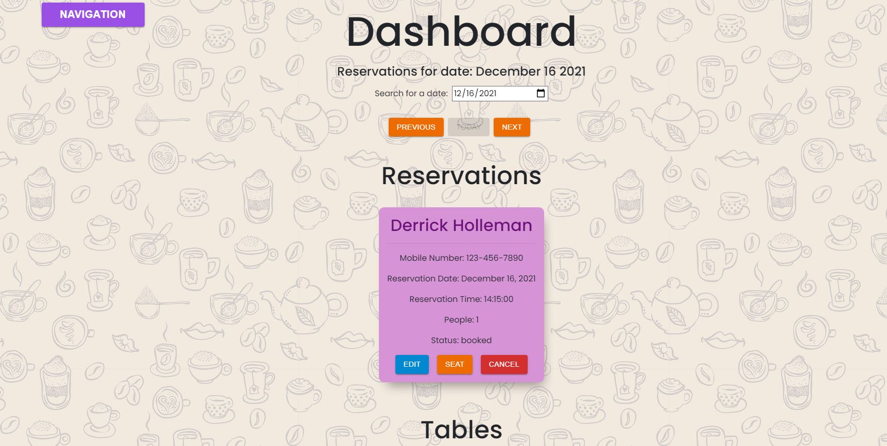
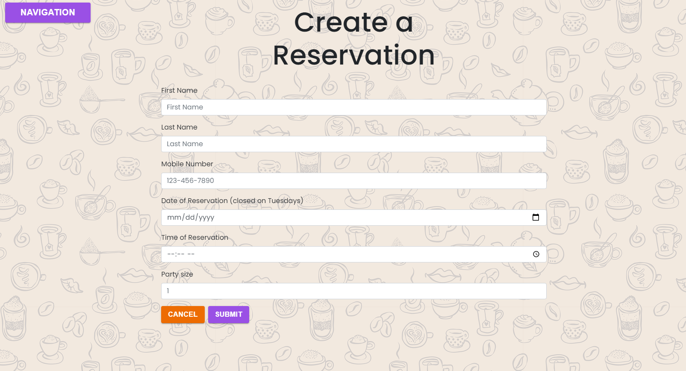
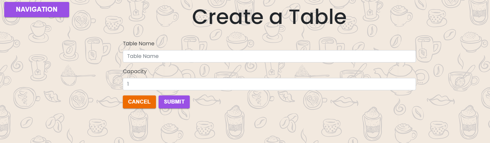
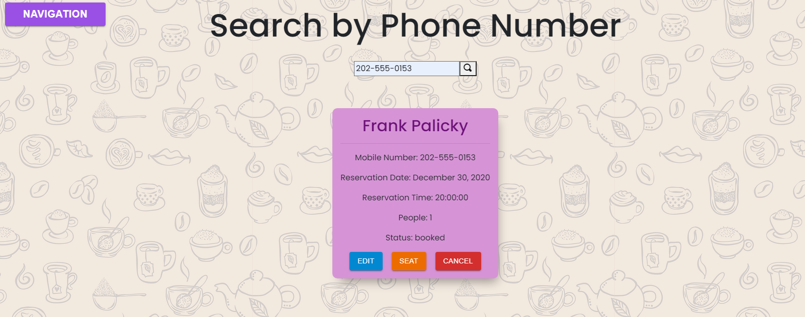
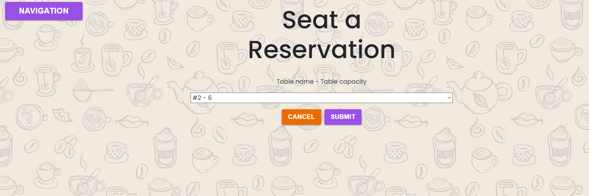

# Thinkful-Final-Capstone: Restaurant Reservation System

## Deployed Application
[Restaurant Reservations](https://res-rev-capstone-frontend.herokuapp.com/dashboard)

## Server Repo 
[Restaurant Reservations Server](https://github.com/derrickholleman/restaurant-reservation-server)


## Project Summary
A full stack web application built with React, Node, Express, CSS, Bootstrap and connected to a PostgreSQL database.

The development process included the use of the following tools and practices:
* Project management tools including Trello and Github projects to create and track user stories and subtasks.
* New features (user stories) were developed on separate branches and merged into main after passing end to end tests.
* Frequent deployments to production with Heroku and Netlify.

This application allows a user to create, edit, and cancel a reservation. Create a table, seat a reservation to a table, and finish a table. As well as search for reservations by phone number.

### The Dashboard

### Create new Reservation

### Create new Table

### Search for Reservation

### Seat a Reservation



## Technologies and Tools
* React
* JavaScript
* Node
* Express
* PostgreSQL
* HTML
* CSS
* Bootstrap
* Material UI
* Open Iconic for icons
* Heroku
* Netlify

## API Documentation

| Route       | Method      | Status Code | Description   |
| :---        |    :----:   |     :----:   |        ---:  |
| /reservations      | GET   | 200  | Returns a list of reservations for the current date |
| /reservations?date=####-##-##      | GET |  200    | Returns a list of reservations for the given date |
| /reservations      | POST  | 201    | Creates a new reservation |
| /reservations/:reservation_id      | GET  | 200     | Returns the reservation for the given ID |
| /reservations/:reservation_id      | PUT  | 200     | Updates the reservation for the given ID |
| /reservations/:reservation_id/status      | PUT  | 200     | Updates the status of the reservation for the given ID |
| /tables   | GET  | 200      | Returns a list of tables     |
| /tables   | POST  | 201      | Creates a new table     |
| /tables/:table_id/seat   | PUT | 200      | Seats a reservation at the given table_id     |
| /tables/:table_id/seat   | DELETE  | 200      | Changes the occupied status to be unoccupied for the given table_id     |


 ### Reservation JSON Example
 ```json
"data": {
        "reservation_id": 13,
        "first_name": "John",
        "last_name": "Doe",
        "mobile_number": "123-456-7890",
        "reservation_date": "2021-09-13T04:00:00.000Z",
        "reservation_time": "13:30:00",
        "people": 1,
        "status": "booked",
        "created_at": "2021-09-13T09:34:07.185Z",
        "updated_at": "2021-09-13T09:34:07.185Z"
    }
```

### Table JSON Example
 ```json
{
            "table_id": 7,
            "table_name": "Cool Kids Table",
            "capacity": 4,
            "reservation_id": 13
        }
```
## Installation
To install dependencies, verify you are in the project root and use npm install.
```
npm install || npm i
```

To start up the React app, from the project root directory, run 'npm run start:frontend'

To start up the server on a localhost, from the project root directory, run 'npm run start:backend'